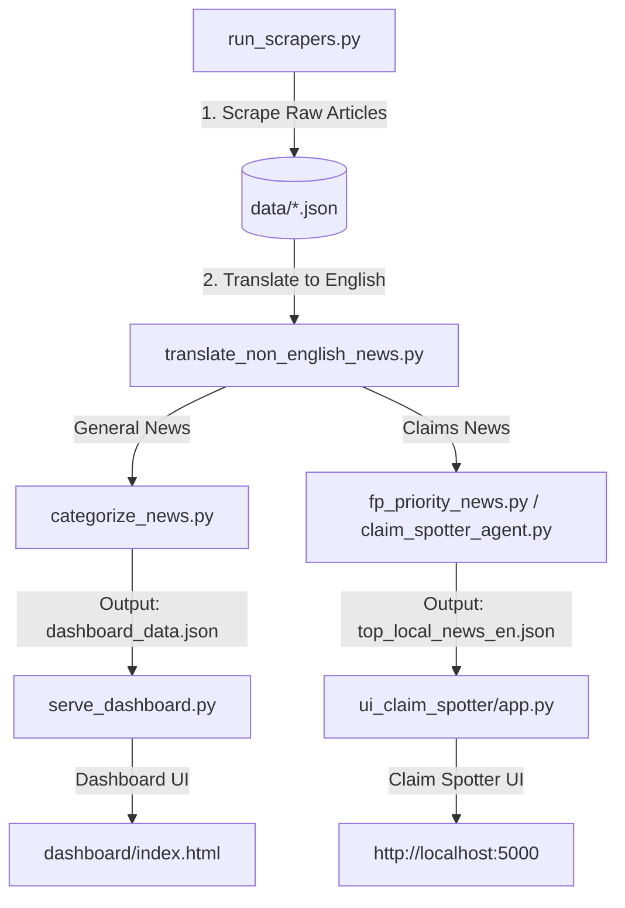

# TimeTwister Workflow Guide

This guide explains the end-to-end pipeline for updating and running the TimeTwister codebase. The repository contains **two distinct news pipelines and dashboards**:

1. **General News Feed Dashboard**: Categorizes, groups, and ranks general Sri Lankan news by importance.
2. **Claim Spotter Dashboard**: Utilizes AI to identify and deduplicate fact-checkable claims (designed for fact-checkers).

---

## 1. Technical Pipeline Flow

Both pipelines share the same initial scraping and translation steps, but split during the AI analysis phase:



---

## 2. Core Initial Pipeline (Common to Both)

Run these two commands first to fetch and prepare the latest news:

### Step 1: Run the Scrapers
```powershell
python run_scrapers.py
```
*To run for a specific date range:*
```powershell
python run_scrapers.py 2026-05-31 2026-06-01
```
***Incremental mode** (every ~10 min; stop when a URL from the last run is seen — Aruna first, more outlets coming):*
```powershell
python scrapers/aruna_selenium_json.py --incremental
# or continuous loop (default 600s / 10 min):
python run_incremental_loop.py --only aruna
# also: sundaytimes, ftlk
python run_incremental_loop.py --only ftlk
```
* **Behind the Scenes**: Launches **17 individual Selenium web scrapers** sequentially. Each runs in an isolated OS subprocess to guarantee clean Chrome memory/process teardowns, preventing crashes and locked ports.
* **Resume Support**: If it gets interrupted, resume from where it failed:
  ```powershell
  python run_scrapers.py --start-from dinamina
  ```

### Step 2: Translate Non-English News
```powershell
python translate_non_english_news.py
```
* **Behind the Scenes**: Translates Sinhala and Tamil articles using the Gemini API. It saves translations to `_translated_en.json` files so the downstream AI processing scripts can analyze a unified language (English).

---

## 3. General News Dashboard Workflow

Follow these steps to update and run the main news feed dashboard:

### Step 3A: Categorize, Deduplicate, and Score
```powershell
python categorize_news.py
```
* **Behind the Scenes**:
  1. Combines all raw articles with their English translations.
  2. Tags each article with its publication language.
  3. Uses Gemini to assign a Category (e.g., Economy, Politics), Tags, and a `base_importance` score (1-5).
  4. Runs a time-window Jaccard algorithm to group potential duplicates, using Gemini to verify and merge identical stories (combining their source lists).
  5. Computes a final importance score: `base_importance + (number of sources - 1)` and saves it to `output/dashboard_data.json`.

### Step 4A: Start the General Dashboard
```powershell
python serve_dashboard.py
```
* **Behind the Scenes**: Starts a local web server on port `8000`. Open `http://localhost:8000/dashboard/index.html` to view the news feed, sort by importance, or filter by language and category.

---

## 4. Claim Spotter Dashboard Workflow

Follow these steps to update and run the fact-checking claim spotter dashboard:

### Step 3B: Extract and Curate claims
Run both scripts to populate the claim analysis dashboards:

1. **Spot Fact-Checkable Claims**:
   ```powershell
   python claim_spotter_agent.py
   ```
   * *What it does*: Uses Gemini to identify verifiable factual claims made by public figures (e.g. GDP, inflation numbers), deduplicates identical claims, and outputs them to `output/claims_YYYYMMDD_HHMMSS.json`.
2. **Curate Top Stories**:
   ```powershell
   python fp_priority_news.py
   ```
   * *What it does*: Deduplicates regional reports, scores them, selects the **Top 7 Sinhala** and **Top 7 Tamil** stories, and saves the output to `output/top_local_news_en.json`.

### Step 4B: Start the Claim Spotter UI
```powershell
cd ui_claim_spotter
pip install -r requirements.txt
python app.py
```
* **Behind the Scenes**: Launches a Flask server. Open `http://localhost:5000` in your web browser to browse the curated claim spotter feed.
